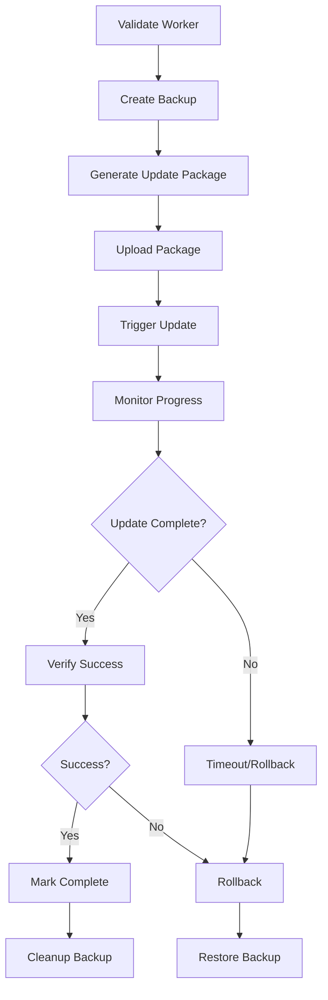

# Version Management System

## Overview

The Version Management System provides comprehensive version tracking, automated updates, and rollback capabilities for remote worker nodes in the distributed translation system. It ensures all workers maintain version consistency and can be safely updated or rolled back when issues occur.

## Architecture

### Core Components

#### VersionManager
The central component responsible for:
- Local version detection and tracking
- Worker version validation
- Automated update orchestration
- Backup and rollback management

#### UpdateBackup
Represents a complete backup of a worker's state before updates:
```go
type UpdateBackup struct {
    WorkerID      string
    BackupID      string
    Timestamp     time.Time
    OriginalVersion VersionInfo
    BackupPath    string
    UpdatePackage string
    Status        string // "created", "active", "rolled_back", "expired"
}
```

#### VersionInfo
Tracks comprehensive version information:
```go
type VersionInfo struct {
    CodebaseVersion string
    BuildTime       string
    GitCommit       string
    GoVersion       string
    Components      map[string]string
    LastUpdated     time.Time
}
```

### Key Features

- **Automatic Version Detection**: Detects local version from git, build files, or explicit version files
- **Worker Validation**: Ensures workers are up-to-date and healthy before work assignment
- **Automated Updates**: Orchestrates complete update cycles with progress monitoring
- **Backup & Rollback**: Creates backups before updates and provides automatic rollback on failures
- **Event Logging**: Comprehensive event emission for monitoring and debugging
- **API Integration**: REST endpoints for manual operations and monitoring

## Version Detection

### Local Version Sources (in priority order)

1. **Version File**: Reads from `VERSION` file in project root
2. **Git Tags**: Uses `git describe --tags --abbrev=0` for tagged releases
3. **Git Commit**: Falls back to `dev-{short-commit-hash}` for development builds

### Component Versions

The system tracks versions for critical components:
- `translator`: Main translation engine
- `api`: REST API server
- `distributed`: Distributed coordination system

### Version Comparison Logic

Versions are considered compatible when:
1. Codebase versions match exactly
2. All critical component versions match exactly

## Update Process

### Complete Update Workflow



### Update Package Generation

Creates compressed tar.gz packages containing:
- All source code and binaries
- Excludes: `.git/`, `build/`, `node_modules/`, cache files
- Named: `translator-update-{version}-{timestamp}.tar.gz`

### Progress Monitoring

- Polls worker version every 10 seconds during update
- 5-minute timeout for update completion
- Comprehensive error reporting and event logging

## Backup & Rollback System

### Backup Creation

Before any update attempt:
1. Creates timestamped backup directory
2. Records original version information
3. Stores backup metadata in memory and filesystem
4. Emits `worker_backup_created` event

### Automatic Rollback Triggers

Rollback occurs automatically on:
- Update package upload failure
- Update application failure
- Post-update verification failure
- Network timeouts or connectivity issues

### Rollback Process

1. **Trigger Rollback**: Send rollback command to worker
2. **Monitor Restoration**: Poll worker until original version confirmed
3. **State Recovery**: Restore service status and version info
4. **Event Logging**: Emit `worker_rollback_completed` event
5. **Cleanup**: Mark backup as rolled back

### Backup Lifecycle

- **Active**: Currently in use during update
- **Completed**: Update succeeded, backup available for manual rollback
- **Rolled Back**: Successfully restored from backup
- **Expired**: Automatically cleaned up after 24 hours

## API Endpoints

### Version Information
```
GET /api/v1/version
```
Returns current worker version information.

**Response:**
```json
{
  "codebase_version": "dev-b7e4c27",
  "build_time": "2024-01-01T00:00:00Z",
  "git_commit": "b7e4c27...",
  "go_version": "go1.21.0",
  "components": {
    "translator": "dev-b7e4c27",
    "api": "1.0.0",
    "distributed": "1.0.0"
  },
  "last_updated": "2024-01-01T00:00:00Z"
}
```

### Update Package Upload
```
POST /api/v1/update/upload
Content-Type: multipart/form-data
X-Update-Version: {version}
```
Uploads update package for installation.

### Update Application
```
POST /api/v1/update/apply
X-Update-Version: {version}
```
Triggers update package installation and application.

### Manual Rollback
```
POST /api/v1/update/rollback
X-Worker-ID: {worker_id}
```
Manually triggers rollback for specified worker.

**Alternative:**
```
POST /api/v1/update/rollback?worker_id={worker_id}
```

## Event System

### Update Events

| Event Type | Description | Data |
|------------|-------------|------|
| `worker_update_started` | Update process initiated | worker_id, target_version, current_version |
| `worker_backup_created` | Backup created before update | worker_id, backup_id, original_version |
| `worker_update_completed` | Update successfully applied | worker_id, version |
| `worker_rollback_started` | Rollback process initiated | worker_id, backup_id, from_version, to_version |
| `worker_rollback_completed` | Rollback successfully completed | worker_id, backup_id, version |

### Version Check Events

| Event Type | Description | Data |
|------------|-------------|------|
| `worker_version_checked` | Version validation performed | worker_id, local_version, worker_version, up_to_date |

## Configuration

### Environment Variables

| Variable | Description | Default |
|----------|-------------|---------|
| `UPDATE_TIMEOUT` | Update completion timeout | 5 minutes |
| `ROLLBACK_TIMEOUT` | Rollback completion timeout | 2 minutes |
| `BACKUP_RETENTION` | Backup cleanup age | 24 hours |

### Directory Structure

```
/tmp/translator-updates/     # Update packages
/tmp/translator-backups/     # Worker backups
├── backup-worker1-1640995200/
├── backup-worker2-1640995300/
└── ...
```

## Monitoring & Metrics

### Health Checks

Workers expose health endpoints that version management uses:
```
GET /health
```
Returns 200 OK when worker is healthy and ready.

### Version Drift Detection

The system continuously monitors for version drift:
- Pre-work validation ensures workers are current
- Automatic updates prevent drift accumulation
- Event logging enables drift analysis and alerting

### Performance Metrics

- Update success/failure rates
- Average update duration
- Rollback frequency
- Backup storage utilization

## Troubleshooting

### Common Issues

#### Update Timeout
**Symptoms:** Update fails with "update timeout" error
**Causes:**
- Worker overloaded or unresponsive
- Network connectivity issues
- Update package corruption

**Solutions:**
1. Check worker logs for detailed error information
2. Verify network connectivity between coordinator and worker
3. Validate update package integrity
4. Consider manual rollback if worker is in inconsistent state

#### Rollback Failure
**Symptoms:** Rollback fails or times out
**Causes:**
- Worker completely unresponsive
- Backup corruption
- Network partition during rollback

**Solutions:**
1. Check worker accessibility and restart if necessary
2. Verify backup integrity in `/tmp/translator-backups/`
3. Manual intervention may be required for severely compromised workers

#### Version Mismatch
**Symptoms:** Worker reports different version than expected
**Causes:**
- Concurrent update operations
- Manual worker modifications
- Clock synchronization issues

**Solutions:**
1. Wait for automatic update cycle to synchronize
2. Check event logs for concurrent operations
3. Verify system clocks are synchronized

### Diagnostic Commands

```bash
# Check worker version
curl -k https://worker.example.com:8443/api/v1/version

# Check worker health
curl -k https://worker.example.com:8443/health

# List active backups
ls -la /tmp/translator-backups/

# Check update packages
ls -la /tmp/translator-updates/
```

### Log Analysis

Key log patterns to monitor:

```
worker_update_started: Update initiated
worker_backup_created: Backup created successfully
worker_update_completed: Update successful
worker_rollback_started: Rollback initiated (indicates failure)
worker_rollback_completed: Rollback successful
```

## Security Considerations

### Update Package Validation
- Packages are digitally signed (future enhancement)
- HTTPS-only communication for all update operations
- Update packages validated before application

### Access Control
- Update operations restricted to authorized coordinators
- Worker authentication required for sensitive operations
- Audit logging of all update and rollback activities

### Backup Security
- Backup files contain sensitive configuration
- Encrypted backup storage (future enhancement)
- Automatic cleanup prevents backup accumulation

## Future Enhancements

### Planned Features
- **Digital Signatures**: Cryptographic verification of update packages
- **Staged Rollouts**: Gradual update deployment with canary testing
- **Update Channels**: Development, staging, and production update channels
- **Metrics Dashboard**: Real-time monitoring of version health across fleet
- **Automated Rollbacks**: AI-driven rollback decisions based on error patterns

### Performance Optimizations
- **Delta Updates**: Only transfer changed files
- **Peer-to-Peer Updates**: Workers update each other to reduce coordinator load
- **Update Caching**: Cache update packages at edge locations

---

## Quick Reference

### Check Worker Status
```bash
# Via API
curl -k https://worker:8443/api/v1/version

# Via distributed manager
dm get-worker-status worker-id
```

### Manual Update
```bash
# Upload package
curl -k -X POST -F "update_package=@update.tar.gz" \
  -H "X-Update-Version: v1.2.0" \
  https://worker:8443/api/v1/update/upload

# Apply update
curl -k -X POST -H "X-Update-Version: v1.2.0" \
  https://worker:8443/api/v1/update/apply
```

### Emergency Rollback
```bash
# Via API
curl -k -X POST -H "X-Worker-ID: worker-01" \
  https://coordinator:8443/api/v1/update/rollback
```

This version management system ensures reliable, automated updates with comprehensive safety mechanisms for production deployment of the distributed translation system.